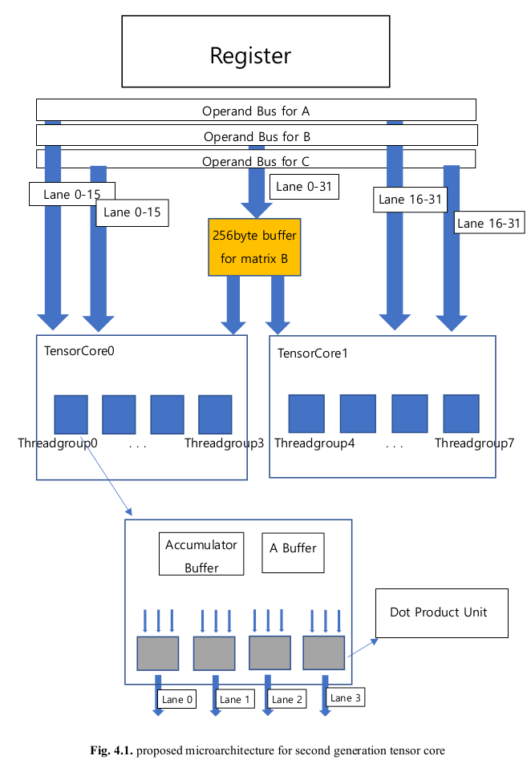
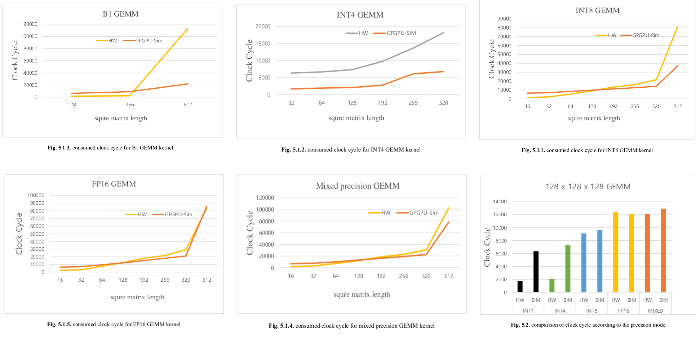

# Abstract
　The current(2020.12) GPGPU-Sim supports up to the 1st Gen(Volta) NVIDIA tensor core. This distribution consists of GPGPU-Sim enabled Turing WMMA API and its benchmark results. Each directory inside the Benchmark directory has hardware benchmark results and revised gpgpu-sim benchmark results. <br>
　In this study, the microarchitecture of Tensor Core in Turing architecture is proposed. Since NVIDIA does not disclose the inside of the tensor core, it is necessary to profile through microbenchmarking. Dissecting the NVIDIA GPUs has also been done in previous studies. However, it was not revealed about the experimental features of the Turing architecture, i.e. INT4(int 4-bit) operation mode and B1(binary 1-bit) operation mode. All of these functions were analyzed in this study.<br><br>


# Repository Structure
* ```gpgpu-sim```
   * GPGPU-Sim enalbed Turing WMMA API
* ```Benchmark```
   * b1(1-bit)
   * u4(unsigned 4-bit)
   * u8(unsigned 8-bit)
   * fp16(floating point 16-bit)
   * mixed(mixed precision)
* ```Paper```
   * Thesis paper<br><br>

# Recommended environment for running benchmark
   * ```GPGPU-Sim 4.0``` (refer to https://github.com/gpgpu-sim/gpgpu-sim_distribution)
   * ```CUDA 10``` or higher
   * NVIDIA graphic card with ```sm_75``` or higher(after Volta arch.)<br><br>
   
# Hardware benchmarking
   0. Go to the directory you want to benchmark.
   1. Set the matrix size at ```test.cu``` inside hard directory.
   2. ```$ make```
   3. See results in the log file <br><br>
# GPGPU-Sim benchmarking
   0. build GPGPU-Sim(check its version of CUDA is 10 or higher)
   1. Set the matrix size at  ```test.cu``` inside sim directory.
   2. ```$ make```
   3. See the result shown by simulator.<br><br>

# Results
* ### Proposed 2nd Gen tensor core architecture <br>
<p align="center"></p><br><br>
* ### Benchmark results <br>
 </img><br><br><br><br>
